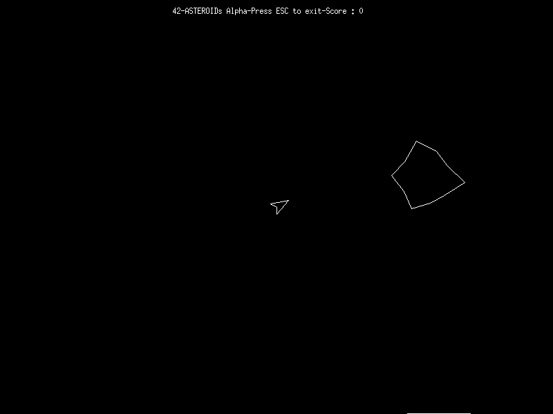

# asteroids

Simple implementation of the classic arcarde game Asteroids in pure C using [Minilibx](https://github.com/42Paris/minilibx-linux) as a side project during my 42 school cursus.

## Dependencies
- Minilibx linux 
  - libbsd
  - XShm extension
> sudo apt-get install gcc make xorg libxext-dev libbsd-dev
- gnu make, gcc
## Compilation 
if you satisfy dependencies just type :
> make 
the binarie should be named asteroid, just type to launch : 
> ./asteroid
## Concepts used 

- the engine uses [Bresenham's line algorithm](https://en.wikipedia.org/wiki/Bresenham%27s_line_algorithm) to draw line.
- the collision detection is using a standard is in circle detection.

## Code Walkthrough 

i ll publish soon a code walkthrough to explain my implementation.
